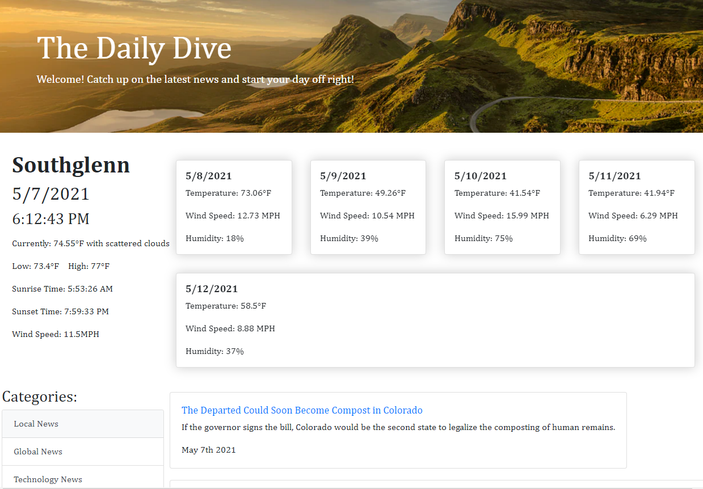

# theDailyDive

## Table of Contents

- [Introduction](#Introduction)
- [Description](#Description)
- [Deployed Webpage](#Deployed-Webpage)
- [Links](#Links)
- [Credits](#Credits)
- [Features](#Features)

## Introduction

Welcome to 'The Daily Dive'! This convenient webpage is your new one-stop, home-screen! Here, you can get useful information and encouragement at the beginning of your day, all in one place!

## Description

'The Daily Dive' has two sections:

- Weather
  - Date and time with current temperature and weather description
  - Important local weather forecast for the rest of the day
- Media
  - Local, global, and technology-related news articles from the NY Times
  - Bible verses for your daily devotional
  - Inspirational quotes

## Deployed Webpage

## Links

- [Deployed](https://Chequelito.github.io/theDailyDive/)
- [GitHub Repo](https://github.com/Chequelito/theDailyDive)

## Credits

- Instructors:

  - Ben Machock
  - Leonardo Silva
  - Zac Stowell

- Collaborators:

  - Sam Roberson
  - Zach Raab
  - Ezequiel Herrera
  - Jon Gregory

## Features

- Multi-API integration.
- Target user's location and for relevant information
- Real-time clock in user's timezone
- Practical and convenient information that is easy to access
- Clean and modern look
